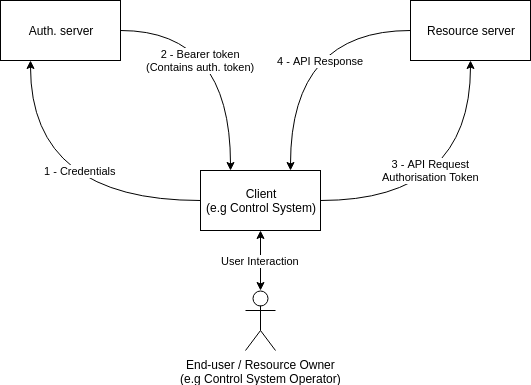

# [Work In Progress] Best Practice Authorisation

## Scope

This document specifies how to implement client authorisation for the NMOS APIs.

This is based on best practice used for RESTful APIs, and is intended to promote a secure approach to interoperability.

Use of insecure communication (plain HTTP etc.) is forbidden within the scope of this document.

Implementation of [BCP-003-01](best-practice-secure-comms.md) is a recommended pre-requisit to implementing this document.

Although security of web pages presented to users is also important,
this is outside the scope of this document, which is concerned only with APIs.

The mechanism used to authenticate users of a system implementing these recommendations is out of scope.

## Use of Normative Language

The key words "MUST", "MUST NOT", "REQUIRED", "SHALL", "SHALL, "NOT", "SHOULD", "SHOULD NOT", "RECOMMENDED", "MAY", and "OPTIONAL" in this document are to be interpreted as described in [RFC 2119](RFC-2119).

## Normative References

These appear at the end of the Markdown source for this document,
and are referenced as hyperlinks within the main body.

## Definitions

_See also the NMOS Glossary, and definitions within RFCs._

### API

An HTTP / WebSocket API as defined in an AMWA NMOS Specification (IS-04, IS-05, IS-06, etc.)

### Client

The entity that is using the API, for example:

- a Node using the IS-04 Registration API
- a monitoring application using the IS-04 Query API
- a connection control application using the IS-05 Connection API

### Protected Resource

Any part the API that is access restricted. This may apply to read (e.g GET) or write (e.g POST) operations.

### Resource Owner

An entity capable of granting the client access to a protected resource. When the resource owner is a person, it is referred to as an end-user.

### Resource Server

The entity that is providing APIs containing protected resources, for example:

- a registry implementing IS-04 Registration and Query APIs
- a Node implementing IS-04 Node API and IS-05 Connection API.

### Authorisation Server

The server issuing access tokens to the client after successfully
authenticating the resource owner and obtaining authorisation.

### Access Token

A short lived JSON Web Token that may be used by a client to access privileged resources on the resource server.

### Bearer Token

Bearer tokens are longer lived in access tokens. They are passed from the authorisation server to the client after successful authentication of client credentials, and contain an access token. Bearer tokens can be used to retrieve further access tokens from the authorisation server once the original access token expires.

### Bearer Token

## Introduction (informative)

This document covers client authorisation, the mechanism by which an AMWA NMOS API may verify that a client accessing
it has the privileges required to access or modify some or all of the content in the API.

This document is not concerned with the security of the connection used to carry out authorisation or subsequently authorised interactions, but for the authorisation mechanisms described in this document to be effective the connection used must be secured, ideally using the recommendations covered in [BCP-003-01](best-practice-secure-comms.md).

The client authentication mechanism described in this document is based on the OAuth2.0 Authorisation Framework [RFC 6749](RFC-6749). In particular JSON Web Tokens are used as the OAuth 2.0 Bearer Tokens and for client authorisation as per [RFC 7523](RFC-7523).

## Authorisation Flow (informative)

A simplified illustration of the authorisation flow is shown below. The API client, in this case a broadcast control system, provides the client's credentials to the Authorisation Server, which verifies them. The mechanism used to verify client credentials is out of scope for this document, but may involve widely used authentication technologies such as a corporate Single Sign On, Kerberos or Microsoft Active Directory for example.

In its request the client will also indicate what privileges it wants included in a token. If the authorisation server is happy that a given client may be permitted the privileges requested it will grant a Bearer Token, containing an Authorisation Token whose "claims" include the requested privileges.

The client uses the token it has been issued with when it makes requests to protected resources on the resource server using the Authorisation Token. The resource server then validates the token, using the public key of the authorisation server. If the client is satisfied the token is valid for the protected resource to be accessed it will carry out the API request as normal.



Tokens are signed using a long-lived private key held by the authorisation server. The authorisation server makes available its public key to resource servers, to allow them to validate tokens using that key.

The Bearer Token issued by the authorisation server are much shorter lived than the Authorisation Server secret key, but longer lived than the Access Token. This means that the client may readily regularly the access token without needing to ask the end-user for their credentials, but allows system administrators the opportunity to revoke access to the protected resources by the client by refusing to issue a new access token when asked for a renewal.

## Authorisation Server Specification

### Authorisation Server API

The Authorisation Server SHALL present an instance of the NMOS API Security API _TODO: Add link_

The Authorisation Server _MAY_ present multiple versions of the API on the same port, but _MUST_ name-space them accordingly as per the API specification.

The Authorisation Server must otherwise be implemented as per [RFC 6749](RFC-6749).

### DNS-SD Advertisement

The Authorisation Server MUST support advertising itself using DNS-SD as per [RFC 6763](RFC-6763). It MUST support advertisement over both mDNS and unicast service but MAY allow the operator to disable one or other of these discovery modes as a configuration option.

The authorisation server MUST advertise itself with the following service type:

```
_nmos-security._tcp
```

The hostname and port of the Authorisation Server MUST be identified via the DNS-SD advertisement, with the full HTTPS path then being resolved via the standard NMOS API path documentation. A DNS A record MUST be provided to allow the hostname to be resolved. The hostname and domain used MUST match one of the Subject Alternate Names provided in the TLS certificate of the authorisation server. The hostname and domain used SHOULD be the Common Name on the TLS certificate of the authorisation server.

Multiple DNS-SD advertisements for the same API are permitted where the API is exposed via multiple ports and/or protocols.

Clients and Resource Servers MUST support discovering the Authorisation Server through use of DNS-SD service discovery, as described in [RFC 6763](RFC-6763). Clients and Resource Servers MAY allow discovery using mDNS to be disabled such that the server may only be discovered through unicast DNS records.

Clients and Resource Servers MUST verify the TLS certificate of the authorisation server. Clients MUST check that the address of the Authorisation Server matches either a Subject Alternate Name or Common Name on the TLS certificate. Clients and Resource Servers MUST provide a mechanism for installing root CA certificates used for verifying the TLS certificate of Authorisation servers. HTTPS MUST be used for all connections to the Authorisation Server. Clients and Resource Servers MUST NOT interact with Authorisation servers if the TLS certificate of the Authorisation server cannot be validated.

#### DNS-SD TXT Records

##### api_ver

The DNS-SD advertisement MUST be accompanied by a TXT record of name 'api_ver'. The value of this TXT record is a comma separated list of API versions supported by the server. For example: 'v1.0,v1.1,v2.0'. There should be no white-space between commas, and versions should be listed in ascending order.

##### pri

The DNS-SD advertisement MUST include a TXT record with key 'pri' and an integer value. Servers MAY additionally represent a matching priority via the DNS-SD SRV record 'priority' and 'weight' as defined in RFC 2782. The TXT record should be used in favour to the SRV priority and weight where these values differ in order to overcome issues in the Bonjour and Avahi implementations. Values 0 to 99 correspond to an active NMOS Authorisation Server API (zero being the highest priority). Values 100+ are reserved for development work to avoid colliding with a live system.

### Authorisation Server Public Key

The Authorisation Server MUST provide all public keys used for signing tokens at the ``certs`` endpoint of the API. The Authorisation MAY present more than one key on this endpoint, with each key being an entry in an array.

All  public keys must be presented using the text representation used by The Secure Shell (SSH) Public Key File Format in [RFC 4716](RFC-4716). Each public key presented will be one entry in the array provided by the `certs` endpoint.

Clients SHOULD seek to fetch public keys from the Authorisation Server at least once every hour. If clients are un-able to contact the Authorisation Server they MUST implement an exponential back-of to avoid over-loading the Authorisation server in the event of a system re-start. If the client is un-able to contact an Authorisation Server it may assume currently held public keys remain valid until it is able to re-establish a connection to an authorisation server.

Clients SHOULD attempt to verify tokens against every public key presented at its Authorisation Server's `certs` endpoint, until it finds a public key that verifies the token, or until no keys are left. If the client has tried all public keys available and failed to verify it MUST reject the token.

#### Changing Keys

When transitioning to a new public/private key pair used for signing tokens the Authorisation Server SHOULD provide both the old and new public key at the `certs` endpoint until all tokens that may be verified by the old public key would have expired. However, if a private key is known to be compromised the authorisation server MUST remove it from the `certs` endpoint immediately.

Authorisation servers SHOULD provide new public keys on the `certs` endpoint for at least 2 hours, before issuing tokens signed by the corresponding private key, to allow time for clients to cache the new public key.

## Client Registration

Clients MUST be registered with the authorisation server before initiating the OAuth 2.0 protocol as per
Section 2 of [RFC 6749](RFC-6749).
The authorisation server MUST NOT accept un-registered clients.

Authorisation servers SHOULD support a manual mechanism for registering clients (e.g an HTML web form)
allowing the client type and re-direct URIs to be provided. Clients SHOULD support a mechanism for providing
the information required for OAuth 2.0 registration (e.g a web page containing the required details).

Clients operating with a client password SHOULD support using HTTP Basic Authentication, as per Section 2
of [RFC 2617](RFC-2617), to authenticate with the Authorisation Server
in the manner described in Section 2.3.1 of [RFC 6749](RFC-6749). Authorisation servers SHOULD provide
support for such registrations.

Clients and Authorisation servers are RECOMMENDED to provide for the OAuth 2.0 Dynamic
Client Registration Protocol [RFC 7591](RFC-7591).

AMWA NMOS Specifications MAY specify additional registration parameters where they require them.
Where clients and authorisation servers that support OAuth 2.0 with these specifications
they SHALL use these parameters in all OAuth 2.0 registration mechanisms they support.

## OAuth Grants

### Client Types (Informative)

[RFC 6749](RFC-6749) defines three different classes of OAuth client:
- Web application – client credentials stored in a server.
- User­-agent­ based application – client credentials stored in the user­agent (e.g browser).
- Native application – client credentials stored in a native application (e.g broadcast control system).

It is important to understand what kind of client is being implemented, as this impacts on the OAuth 2.0
grant that it may use.

Typically clients for NMOS APIs are Broadcast Control Systems, or the broadcast equipment they control
(a "Node" in the JTNM reference architecture).

Clearly a broadcast control system that is built as a native app is a "Native Application" type, and
a control system implemented in a browser is a "User-agent based application", and they should be treated
accordingly when implementing OAuth. [RFC 6749](RFC-6749) defines both these client types to be
_Public Clients_.

Out of these three client types an NMOS Node most closely resembles a web application, because client
credentials are not stored in the user-agent or a native application.
Instead they are stored on a server away from the resource owner.
The web application client type is the only OAuth 2.0 client type where this is
permitted to be the case. [RFC 6749](RFC-6749) considers such clients to be _Confidential Clients_.

### Grant Types

OAuth 2.0 defines four different grant types:

- Authorisation Code Grant
- Implicit Grant
- Resource Owner Password Credentials Grant
- Client Credentials Grant.

The authorisation code grant is optimised for confidential clients, and is a good choice for NMOS Node type
clients devices, but is less well suited to control system type clients.

The implicit grant is designed for public clients, and therefore is unsuited to confidential clients, but is
generally used for use-agent based clients.

The resource owner password grant is designed for situations where the resource owner has a strong trust
relationship with the client – this is typically reserved for clients like operating systems or other highly
privileged software. This may be the case for native application broadcast control systems, but not those
implemented in the user-agent (e.g browser). This grant is not suitable for NMOS Node type clients.

The client authentication grant is suitable for confidential clients, but requires the resource owner 
arrange for the authorisation server to allow access to protected resources out of band rather than as part 
of the grant process.
This may be suitable for use with NMOS, especially where the authorisation server forms part of a
larger broadcast control system.

Individual AMWA NMOS specifications MAY specify the grants permitted for the API clients involved in the
specification, however the guidance above for the suitability of different grants for user with certain
clients SHOULD be followed. Unless otherwise specified by the AMWA NMOS Specifications it supports an
Authorisation Server SHOULD support all four grant flows.

## Tokens

### Authorisation Server Response

Successful authorisation requests shall be serviced by the authorisation server as defined in
[RFC 6749](RFC-6749) Section 5.1.
Additionally the `expires_in` and `refresh_token` fields MUST be included in the response.

Un-successful authorisation responses should be handled as per Section 5.2 of [RFC 6749](RFC-6749).

### Access Tokens

The access token type returned MUST be of the `Bearer_token` type specified in [RFC 6750](RFC-6750).

The access token MUST be a JSON Web Signature (JWS) as defined by [RFC 7515](RFC-7515).
JWAs MUST NOT be used.

The JWS MUST be signed with `RSASSA-PKCS1-v1_5 using SHA-512`, meaning the value of the `alg` field in the
token's JOSE header MUST be set to `RS512` as defined in [RFC 7518](RFC-7518). An example JOSE header would
be:

```json
{
  "typ": "JWT",
  "alg": "RS512"
}
```

#### Registered Claims

Registered claims are defined in the authorisation JSON Web Token specification in [RFC 7519](RFC-7519), but their specific usage is left to the application. NMOS API Clients and Servers implementing this BCP MUST employ the restrictions on claims outlined below, in addition to implementing tokens as specified in [RFC 7519](RFC-7519).

##### iss
_Identifies principal that issued the JWT_

The `iss` (issuer) claim MUST be included in the token. The claim MUST contain the DNS
name and port of the authorisation server accessible to the audience of the token.
The contents of this claim MUST match one entry in the common name field or alternate
names fields in all TLS certificates used by the authorisation server for securing the authorisation
API, in order to allow the verifier of the token to fetch the public key of the authorisation server.

##### sub
_Identifies the subject of the JWT_

The sub (subject) claim MUST be included in the token. This claim MUST contain a unique identifier assigned
to the client by the authorisation server. For example, this may be a username in the system, or an
email address of the user. This is primarily intended for audit use (e.g to appear in logs), and as such
should be meaningful in that context.

##### aud
_Identifies the recipients of the JWT_

The `aud` (audience) claim MAY be included in the token, but MUST be included where an AMWA NMOS
Specification the token is to be used with requires it.

AMWA NMOS APIs are free to specify their own audience claims, but in the absence of specification resource
servers SHOULD assume that the audience claim contains the fully resolved domain name of the intended
recipient. If the `aud` claim is present and does not match the fully resolved domain name of the resource
server the resource server MUST reject the token.

##### exp
_Expiration time of the token_

The `exp` (expiration) claim MUST be included in the token. This is defined in [RFC 7519](RFC-7519) as being a JSON
NumericDate field, which uses the UTC epoch. This is in contrast to the TAI epoch used elsewhere
within the NMOS APIs, so implementers should take care to ensure they are using the correct
epoch.
API implementations MUST reject a token where the exp claim value is less than the current UTC
time.

##### iat
_Token issued at time_

The `iat` (issued at) claim MAY be included in the token. As with the `exp` claim this claim uses UTC. API
implementations MUST reject a token where the iat claim is greater than the current UTC time.
Authorisation servers SHOULD NOT issue a token with an `iat` claim that is significantly greater or
less than the UTC time at which the token is issued.

#### Public Claims

[RFC 7519](RFC-7519) allows for “public claims”. The name of a public claim should be "collision resistant". Additionally, the name may be registered in the IANA "JSON Web Token Claims".

The following claim is used for an access policy to be included whose effective permisisons will be added to those of the identity established with a given token.

##### x-nmos-api-policy
_Contains a resource access policy particular to NMOS_

The `x•-nmos-•policy` claim MAY be included in the token. The value of the claim is a JSON object, the contents of which are defined by AMWA specifications.

The only entry in this object required by this specification is the “version” field. This should be the version of the resource access policy language defined by AMWA specifications.

#### Private Claims

[RFC 7519](RFC-7519) allows for “private claims”. The following claim is used to identify the API
specification a given token is used for.

##### x-nmos-api
_Contains information particular to the NMOS API the token is intended for_

The `x­-nmos-­api` claim MUST be included in the token. The value of the claim is a JSON object, the
contents of which are defined by AMWA specifications.
The only entry in this object required by this specification is the “name” field. This should be the
identifier of the AMWA specification the token is to be used for in lower case. For example the IS­04
minimal claim is as follows:

```json
"x-nmos-api":{
  "name": "is-04"
}
```
In addition specifications MAY require a `version` field be included, to indicate which version of the API
the token may be used with. This filed MUST contain a JSON array. Each element of the array MUST be the 
version number of API the token may be used with.

```json
"x-nmos-api":{
  "name": "is-04",
  "version": ["1.0","1.1","1.2"]
}
```

In addition individual AMWA specifications MAY also specify additional entries in the object.
For example, IS­04 could define an entry “node­read”, which may be either true of false.
An example of the resulting x­nmos­api claim  is shown below.

```json
"x-nmos-api": {
  "name": "is-04",
  "version": ["1.0","1.1","1.2"],  
  "node-read": true
}
```

Authorisation servers MAY only have support for certain NMOS API specifications, and MAY only
support certain versions of such APIs.

#### Size Considerations

While neither [RFC 7519](RFC-7519) does not prescribe a maximum size for an OAuth2.0 JSON
Web Token, it should be noted that these tokens are typically used within an HTTP header.
While HTTP does not define a header size limit, 8KByte is a common limitation in HTTP
server implementations.
Specification writers should be mindful of this when designing API claims, and ensure that enough space is
available in the header for both the token and all other HTTP headers.

#### Example Authorisation Token Claim Set

```json
{
  "iss": "https://auth.example.com",
  "sub": "username@example.com",
  "aud": "https://node.example.com",
  "iat": "1548779460",
  "exp": "1548783060",
  "x-nmos-api": {
    "name": "is-04",
    "node-read": true
  }
}
```

### Token Lifetime and Refresh

A given token for an NMOS API may be used on more than one Node or registry instance.
If one of these Nodes or registries is compromised it is possible for that entity to “capture” that token, 
and use it itself maliciously.
While the precise duration of token validity should be left to implementers and administrators based on risk
profile, these tokens SHOULD ideally be set to be valid for no more than one hour.

However, if tokens are too short lived, the number of refresh requests to the authorisation server for new
tokens starts to become a significant overhead, and any latency involved in using a token may cause it to
become invalid during transit. As such it is RECOMMENDED that tokens be valid for at least 30 seconds.
Clients SHOULD ensure tokens are refreshed sufficiently in advance of their expiry.
While the exact time will depend on the implementation of the client and authorisation server, it is
RECOMMENDED to attempt a refresh at least 15 seconds before expiry
(i.e the half life of the shortest possible lived token).

## Interaction With Other AMWA Specifications

### AMWA NMOS IS-04

TODO: Needs further discussion with IS-04 group

[//]: ## (References)

[//]: ### (Normative)

[RFC-6749]: https://tools.ietf.org/html/rfc6749
"The OAuth 2.0 Authorization Framework"

[RFC-6763]: https://tools.ietf.org/html/rfc6763
"DNS-Based Service Discovery"

[RFC-4716]: https://tools.ietf.org/html/rfc4716
"The Secure Shell (SSH) Public Key File Format"

[RFC-7519]: https://tools.ietf.org/html/rfc7519
"JSON Web Token (JWT)"

[RFC-6750]: https://tools.ietf.org/html/rfc6750
"The OAuth 2.0 Authorization Framework: Bearer Token Usage"

[RFC-7515]: https://tools.ietf.org/html/rfc7515
"JSON Web Signature (JWS)"

[RFC-2119]: https://tools.ietf.org/html/rfc2119
"Key words for use in RFCs to Indicate Requirement Levels"

[RFC-2617]: https://tools.ietf.org/html/rfc2617
"HTTP Authentication: Basic and Digest Access Authentication"

[RFC-7591]: https://tools.ietf.org/html/rfc7591
"OAuth 2.0 Dynamic Client Registration Protocol"
