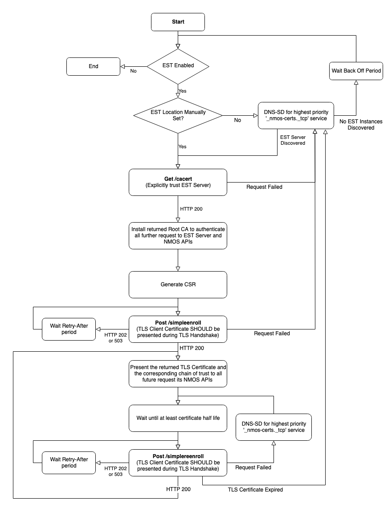

# [Work In Progress] Best Practice Certificate Provisioning

<!-- TOC -->

- [[Work In Progress] Best Practice Certificate Provisioning](#work-in-progress-best-practice-certificate-provisioning)
    - [Scope](#scope)
    - [Use of Normative Language](#use-of-normative-language)
    - [Normative References](#normative-references)
    - [Definitions](#definitions)
        - [API](#api)
        - [CSR (Certificate Signing Request)](#csr-certificate-signing-request)
        - [EST (Enrollment over Secure Transport)](#est-enrollment-over-secure-transport)
        - [EST Server](#est-server)
        - [EST Client](#est-client)
        - [NMOS Server](#nmos-server)
        - [NMOS Client](#nmos-client)
    - [Introduction (informative)](#introduction-informative)
    - [Automated Certificate Provisioning Flow (informative)](#automated-certificate-provisioning-flow-informative)
    - [DNS-SD Advertisement](#dns-sd-advertisement)
        - [DNS-SD TXT Records](#dns-sd-txt-records)
            - [pri](#pri)
            - [api_selector](#api_selector)
    - [EST Server Behaviour](#est-server-behaviour)
        - [EST Server API](#est-server-api)
        - [EST Server Authentication](#est-server-authentication)
        - [EST Server - Client Authentication](#est-server---client-authentication)
    - [EST Client](#est-client-1)
        - [Initial Certificate Provisioning](#initial-certificate-provisioning)
            - [EST Server Discovery](#est-server-discovery)
            - [Get Root CA](#get-root-ca)
            - [Generate Certificate Signing(CSR) Request](#generate-certificate-signingcsr-request)
            - [Certificate Request](#certificate-request)
        - [Certificate Renewal](#certificate-renewal)
        - [Root Certificate Authority Renewal](#root-certificate-authority-renewal)
        - [Expired Manufacturer Issued TLS Client Certificate](#expired-manufacturer-issued-tls-client-certificate)
        - [Connection to new network](#connection-to-new-network)
        - [Certificate Revocation](#certificate-revocation)
    - [TODO:](#todo)
    - [Further Reading](#further-reading)

<!-- /TOC -->

## Scope

This document specifies how to implement automated provisioning of TLS Server Certificates to NMOS APIs.

This is based on best practice used for RESTful APIs, and is intended to promote a secure approach to interoperability.

Use of insecure communication (plain HTTP etc.) is forbidden within the scope of this document.

Implementation of [BCP-003-01](best-practice-secure-comms.md) is recommended alongside implementing this document.

## Use of Normative Language

The key words "MUST", "MUST NOT", "REQUIRED", "SHALL", "SHALL NOT", "SHOULD", "SHOULD NOT", "RECOMMENDED", "MAY", and "OPTIONAL" in this document are to be interpreted as described in [RFC 2119][RFC-2119].

## Normative References

These appear at the end of the Markdown source for this document,
and are referenced as hyperlinks within the main body.

## Definitions

_See also the [NMOS Glossary](https://github.com/AMWA-TV/nmos/wiki/Glossary), and definitions within RFCs._

### API

An HTTP / WebSocket API as defined in an AMWA NMOS Specification (IS-04, IS-05, IS-06, etc.)

### CSR (Certificate Signing Request)

The syntax used to request a TLS Certificate from a Certificate Authority, it contains the public key and identification information required by the Certificate Authority in the PKCS Format, [RFC 2986][RFC-2986]

### EST (Enrollment over Secure Transport)

Enrollment over Secure Transport defines a profile for requesting TLS certificates over a secure transport protocol.

### EST Server

The entity that is providing the EST API in accordance with [RFC 7030][RFC-7030]

### EST Client

The entity that is using the EST API, for example:

- a Node requesting a TLS Server Certificate
- a Node requesting the latest Root CA of the domain

### NMOS Server

The entity that is providing an NMOS API, for example:

- a registry implementing IS-04 Registration and Query APIs
- a Node implementing the IS-04 Node API and IS-05 Connection API

### NMOS Client

The entity that is using the NMOS API, for example:

- a Node using the IS-04 Registration API
- a monitoring application using the IS-04 Query API
- a connection control application using the IS-05 Connection API

## Introduction (informative)

This document covers the automated provisioning of TLS Certificates to NMOS Servers, which are then used to secure communications between NMOS Servers and NMOS Clients.

This document is not concerned with the security of the connection used to carry out provisioning of the TLS Certificate, but for the mechanism described in this document to be effective the connection must be secured, ideally using the recommendation covered in [BCP-003-01](best-practice-secure-comms.md).

## Automated Certificate Provisioning Flow (informative)

To enable zero-configuration TLS Certificate provisioning, NMOS implementations must include a unique TLS Client Certificate, signed by the manufacturer's Certificate Authority. Manufacturers must provide the corresponding Root Certificate Authority public key to customers. If the TLS Client Certificate or the chain of trust is compromised, the manufacturer must revoke the comprised certificates.

1. Before the NMOS Node(EST Client) is shipped from the factory it must be provisioned with a unique TLS Client Certificate, signed by the manufacturer's Certificate Authority
2. When the EST Client is connected to the target environments network, it will first discover the location of the EST Server using Unicast DNS-SD.
    * The EST Client should assume the EST server found using DNS-SD is trusted and need not perform certificate verification for this initial transaction.
3. The EST Client should then request the Root CA for the target network, from the EST Server
    * Using the Root CA returned to secure further communications with the EST Server and NMOS Servers
4. The EST Client must generate a Certificate Signing Request(CSR) for all supported digital signature algorithms with appropriate key lengths
    * Included in the CSR must be the DNS resolvable name for the current domain of the EST Client
    * Appropriate values for the remaining CSR fields should be used
5. The EST Client should send each CSR to the EST Server
    * The EST Client must provide the Manufacturer issued certificate during the TLS handshake, if valid
    * The EST Server will use the TLS Client Certificate to validate whether the EST Client is authorized to be issued with a TLS Server Certificate. If the EST Client is validated the EST Server will return a signed TLS Certificate
6. The EST Client should provide the returned TLS Certificate and the corresponding chain of trust for all future request to its NMOS APIs

The workflow if no valid Manufacturer TLS Client Certificate is present or if EST Client is moved to a new network are covered in detail in the following [sections](#est-client).



## DNS-SD Advertisement

The EST Server MUST be advertised using unicast DNS-SD as per [RFC 6763][RFC-6763].
The EST Server SHOULD NOT be advertised via mDNS-based DNS-SD.
EST Clients MUST not trust a mDNS-based DNS-SD advertisement for the EST server.
The EST Server MUST be advertised with the following service type:

```
_nmos-certs._tcp
```

The hostname and port of the EST Server MUST be identified via the DNS-SD advertisement, with the full HTTPS path then being resolved via the use of the path-prefix of `/.well-known/` as defined in [RFC 5785][RFC-5785] and the registered name of `est`. Thus, a valid example EST server URI path begins with `https://www.example.com/.well-known/est/`. A DNS A record MUST be provided to allow the hostname to be resolved.

Multiple DNS-SD advertisements for the same API are permitted where the API is exposed via multiple ports and/or protocols.

EST Clients MUST support discovering the EST Server through use of unicast DNS-SD service discovery, as described in [RFC 6763][RFC-6763].

### DNS-SD TXT Records

#### pri

The DNS-SD advertisement MUST include a TXT record with key 'pri' and an integer value. Servers MAY additionally present a matching priority via the DNS-SD SRV record 'priority' and 'weight' as defined in [RFC 2782][RFC-2782]. The TXT record should be used in favour of the SRV priority and weight where these values differ, in order to overcome issues in the Bonjour and Avahi implementations. Values 0 to 99 correspond to an active EST Server API (zero being the highest priority). Values 100+ are reserved for development work to avoid colliding with a live system.

#### api_selector

The DNS-SD advertisement MAY include a TXT record with key 'api_selector' and a string. The 'api_selector' key defines an arbitrary label that if present MUST be appended to the well-know EST path, for example `https://www.example.com/.well-known/est/<arbitrary label>/`. The arbitrary label is specified in the EST [RFC 7030][RFC-7030] and allows multiple EST Server instances on a single host to be used. If the 'api_selector' key is not present in the TXT record, the EST Client must not append anything to the well-know EST path.

## EST Server Behaviour

The EST server must be implemented in accordance with [RFC 7030][RFC-7030].

### EST Server API

The EST Server SHALL present an instance of the EST API as defined in [RFC 7030][RFC-7030].

This MUST include the following API endpoints:

| Operation                       | Operation path  |
| ------------------------------- | --------------- |
| Distribution of CA Certificates | /cacerts        |
| Enrollment of Clients           | /simpleenroll   |
| Re-enrollment of Clients        | /simplereenroll |


### EST Server Authentication

The EST Server MUST present a valid TLS Server Certificate, this Certificate MUST either be signed by the CA for the realm to which it is issuing certificates or by a publicly trusted CA.

### EST Server - Client Authentication

The EST Server MUST authenticate the EST Client that is requesting a TLS Certificate manually or automatically using a TLS Client Certificate.

The EST Server MUST support using a TLS Client Certificate, presented during the TLS handshake by the EST Client to authenticate if the EST Client is trusted. The TLS Client Certificate can either be signed by the current CA or an externally trusted Root CA. The EST Server MUST check the validity of the EST CLients TLS Certificate before responding to its request. The EST Server MUST provide a method to load multiple trusted Root CA's, that are used to verify TLS Client Certificate.

The EST Server MAY also support manual authentication of the EST Client if:
- No TLS Client Certificate is presented during the TLS handshake
- The TLS Client Certificate is not trusted
- As an extra authentication step.
The exact process for manual authentication will be implementation specific, but the EST Server MUST provide enough information to the operator so they can authenticate the EST Client. During the manual authentication the EST Server MUST respond with either HTTP 202 or HTTP 503 and the response must include a `Retry-After` header.

The EST Server MUST be capable of issuing TLS Certificates signed with both RSA and ECDSA keys.

The EST Server MUST return a TLS Certificate with the Extended Key Usage set for both TLS Server Authentication and TLS Client AUthentication as per [RFC 5280][RFC-5280]. This is to allow the TLS Certificate to be used both as a server certificate to authenticate NMOS APIs to NMOS Clients and for authentication of the EST Client to the EST Server during certificate renewal.

## EST Client

The EST Client manufacturer SHOULD issue a unique TLS Client Certificate for every device. It is RECOMMENDED that this certificate be valid for a maximum of 10 years. The Root CA used to sign it is RECOMMENDED to be valid for a maximum of 20 years.

An EST Client SHOULD allow EST to be disabled, preventing the EST Client from being automatically provisioned with a TLS Certificate if required by the networks security policy. The default value SHOULD be EST **Enabled**.

An EST Client SHOULD allow manual configuration of the EST Server's Hostname and Port, to prevent the EST Client from requesting a TLS Certificate from a rogue server. The default value SHOULD be **Not Set**, enabling DNS-SD discovery.

An EST Client SHOULD allow explicit trust of EST server to be disabled, to prevent the EST Client from requesting a TLS Certificate from a rogue server. The default value SHOULD be explicit trust of EST Server **Enabled**.

An EST Client MUST maintain a list of publicly trusted Certificate Authorities, used to verify the identity of the EST Server. It MUST be possible to update this list of publicly trusted Certificate Authorities.

An EST Client MUST provide a method to manually install both the Root Certificate Authorities and TLS Server certificate for the target environment, for the case when an EST Server is not present or the TLS Client Certificate is no longer valid.

An EST Client MUST provide a method to replace the Manufacturer Issued TLS Certificate, for the case when the TLS Certificate has been revoked or expired.

If the EST Server returns a HTTP re-direct, the the EST Client SHOULD follow the re-direct URL.

If the EST Server returns an HTTP 4xx, HTTP 5xx or Connection Timeout, the EST Client SHOULD attempt the request again using an alternative EST Server if present, else the EST Client SHOULD wait an appropriate exponential backoff period before retrying.

### Initial Certificate Provisioning

#### EST Server Discovery

On connection to the target environments network the EST Client SHOULD attempt to discover the location of the EST Server using [DNS-SD](#dns-sd-advertisement), if EST has not been disabled or the location of the EST configured manually.

#### Get Root CA

There are two possible workflows to getting the Root CA depending on if explicit trust of EST server is enabled or disabled.

If explicit trust of the EST Server is **Enabled**, the EST Client SHOULD make a HTTPS request to the `/cacerts` endpoint of the EST Server for the latest Root CA of the current network. The EST Client SHOULD explicitly trust the EST Server manually configured or discovered using Unicast DNS and not perform authentication of the EST Server's TLS Certificate during the initial request to the EST Server. If the EST Server returns a HTTP 200 response, the EST Client SHOULD add the returned Root CA to the list of trusted Certificate authorities, replacing any previously installed Root CAs which were obtained via EST.

If explicit trust of the EST Server is **Disabled**, the EST Client SHOULD make a HTTPS request to the `/cacerts` endpoint of the EST Server for the latest Root CA of the current network. The EST Client MUST perform authentication of the EST Server's TLS Certificate, using the list of publicly trusted Certificate Authorities. If the EST Server returns a HTTP 200 response, the EST Client SHOULD add the returned Root CA to the list of trusted Certificate authorities, replacing any previously installed Root CAs which were obtained via EST.

#### Generate Certificate Signing(CSR) Request

The EST Client SHOULD create a CSR for each digital signature algorithm it supports with an appropriate Key Length. The CSR MUST contain a Common Name that is resolvable via DNS on the current domain and appropriate values for the other CSR fields. The manufacturer MAY allow the optional CSR fields to be configured by the operator.

#### Certificate Request

For each generated CSR the EST CLient SHOULD make a HTTPS request containing the CSR to the `/simpleenroll` endpoint of the EST Server. The EST Client SHOULD include the manufacturer installed TLS Client Certificate if present and valid during the TLS handshake with the EST Server. If the TLS certificate is no longer valid, the [Expired Manufacturer Issued TLS Client Certificate](#Expired-Manufacturer-Issued-TLS-Client-Certificate) workflow should be followed.

If the EST Server returns a HTTP 200 response the certificate request was successful and the EST Client should use the returned TLS Certificate and its chain of trust for all further requests to NMOS APIs.

If the EST Server returns a HTTP 202 or HTTP 503 response, the request was successful, but the certificate has not been processed yet. The response SHOULD include a `Retry-After` header and the EST Client MUST not attempt re-sending the request before the defined time has expired. The EST Client SHOULD attempt resending the request 5 times before aborting the certificate request and attempting with an a alternative EST Server. [RFC 7030 Section 4.2.3](https://tools.ietf.org/html/rfc7030#section-4.2.3)

If the EST Server returns any other HTTP response, the request has been unsuccessful, this could be caused by a malformed request, server side error or the EST Client not being authorised. The EST Client SHOULD restart the EST workflow with an alternative EST Server if present, else the EST Client SHOULD implement an exponential backoff algorithm, with a staring period of 1 second before retrying.

### Certificate Renewal

Renewal of the TLS Certificate SHOULD be attempted no sooner than 50% of the certificates expiry time or before the 'Not Before' date on the certificate. It is RECOMMENDED that certificate renewal is performed after 80% of the expiry time. If the EST Clients TLS Certificate is no longer valid then [Initial Certificate Provisioning](#initial-certificate-provisioning) workflow should be followed.

The EST Client SHOULD generate a new CSR matching the TLS certificate it is being used to replace. The EST Client SHOULD make a HTTPS request containing the CSR to the `/simplereenroll` endpoint of the EST Server. The EST Client MUST include the TLS Certificate being renewed during the TLS handshake with the EST Server.

If the EST Server returns a HTTP 200 response the certificate request was successful and the EST Client should use the returned TLS Certificate and its chain of trust for all further requests to its NMOS APIs. The EST Client MUST remove any previously issued TLS Certificates and key pairs.

If the EST Server returns any other HTTP response, the request has been unsuccessful. The EST Client SHOULD re-submit the request to an alternative EST Server if present. Otherwise the EST Client SHOULD carry on using the existing TLS Certificate if still valid and re-attempt renewal after half of the remaining period of validity has elapsed.

### Root Certificate Authority Renewal

Renewal of the Root CA SHOULD be attempted no sooner than 50% of the certificates expiry time or before the 'Not Before' date on the certificate. It is RECOMMENDED that certificate renewal is performed after 80% of the expiry time. To renew the Root CA and the EST Clients TLS Certificate follow the [Initial Certificate Provisioning](#initial-certificate-provisioning) workflow, using the existing TLS Certificate for authentication if still valid.
If the returned Root Certificate Authority by the EST Server is the same as the existing Root Certificate Authority, the EST Client SHOULD re-attempt renewal of the Root Certificate Authority after half of the remaining period of validity has elapsed.

### Expired Manufacturer Issued TLS Client Certificate

If the manufacturer issued TLS Client Certificate has expired or has been revoked, it MUST NOT be used by the EST Client for authentication. An EST Client MAY attempt to request a TLS Certificate following [Initial Certificate Provisioning](#initial-certificate-provisioning), without providing a TLS Client Certificate during the TLS handshake. If the EST Server supports manual authentication the request will be processed.

If the EST Server fails to process the request the following actions MAY be taken:
1. The EST Client MAY have a TLS Certificate for the target network manually installed on the device. The manually installed TLS certificate MUST then be used to secure its NMOS APIs until the TLS Certificate is due for renewal. The manually installed TLS Certificate MUST be presented during the TLS Handshake for [Certificate Renewals](#certificate-renewal). If the certificate renewal is successful, the manually installed TLS Certificate and private key MUST be removed.
2. The Manufacturer issued TLS Client Certificate MAY be renewed by a software/firmware update, this update MUST contain a unique TLS certificate per device. The valid TLS Client Certificate MAY then be used during [Initial Certificate Provisioning](#initial-certificate-provisioning)

### Connection to new network

It MAY be desirable that when a EST Client is connected to a different network that it automatically requests a TLS Certificate for the new network.

On start up or on change of network state the EST Client MUST attempt to discover the EST Server using [DNS-SD](#dns-sd-advertisement), unless the location of the EST Server is manually configured. The EST Client SHOULD make a request to the `/cacerts` endpoint, if the request is successful the EST Client SHOULD compare the returned Certificate to the currently install Root CA. If the Certificate is for a different Domain the EST Client MUST follow the [Initial Certificate Provisioning](#initial-certificate-provisioning) workflow.

### Certificate Revocation

The EST Client SHOULD periodically check the revocation status of both the Root CA and their TLS Certificates using [OCSP][RFC-6960] and [CRL][RFC-5280]. If a TLS Certificate is revoked, the EST Client MUST stop using the revoked certificate immediately and follow [Initial Certificate Provisioning](#initial-certificate-provisioning) workflow to replace the certificate.

## TODO:
* Consider alternative authentication methods of trusted EST Clients
* Specification of returned TLS certificate format (eg, .p7, .pem)?
* Generate a new Key Pair for each TLS Certificate renewal?
* Support for server side generation of keys?
* Consider using using TLS Client Certificates when using NMOS API, for use with BCP-003-02 OAuth
* Does this model extend, when broadcast facilities are connected across WANs or the internet
* Discuss the use of using a publicly trusted CA to sign the EST servers certificate, this means devices must keep a list of trusted CAs and have a method to update these

## Further Reading

The IETF RFCs referenced here provide much more information.

[RFC 2119][RFC-2119] - Key words for use in RFCs to Indicate Requirement Levels

[RFC 2617][RFC-2617] - HTTP Authentication: Basic and Digest Access Authentication

[RFC 2782][RFC-2782] - A DNS RR for specifying the location of services (DNS SRV)

[RFC 2986][RFC-2986] - PKCS #10: Certification Request Syntax Specification

[RFC 5280][RFC-5280] - Internet X.509 Public Key Infrastructure Certificate and Certificate Revocation List (CRL) Profile

[RFC 5785][RFC-5785] - Defining Well-Known Uniform Resource Identifiers (URIs)

[RFC 8615][RFC-8615] - Well-Known Uniform Resource Identifiers (URIs)

[RFC 6763][RFC-6763] - DNS-Based Service Discovery

[RFC 6960][RFC-6960] - X.509 Internet Public Key Infrastructure Online Certificate Status Protocol - OCSP

[RFC 7030][RFC-7030] - Enrollment over Secure Transport

[RFC-2119]: https://tools.ietf.org/html/rfc2119

[RFC-2617]: https://tools.ietf.org/html/rfc2617

[RFC-2782]: https://tools.ietf.org/html/rfc2782

[RFC-2986]: https://tools.ietf.org/html/rfc2986

[RFC-5280]: https://tools.ietf.org/html/rfc5280

[RFC-5785]: https://tools.ietf.org/html/rfc5785

[RFC-8615]: https://tools.ietf.org/html/rfc8615

[RFC-6763]: https://tools.ietf.org/html/rfc6763

[RFC-6960]: https://tools.ietf.org/html/rfc6960

[RFC-7030]: https://tools.ietf.org/html/rfc7030
